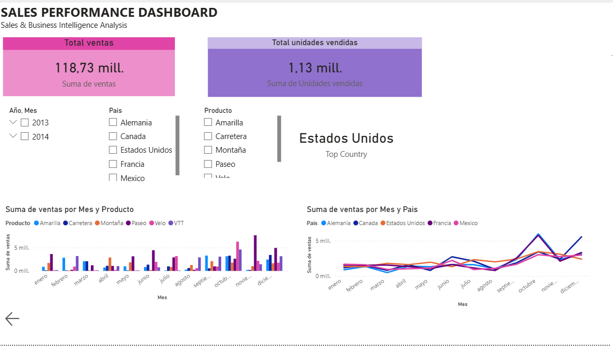

# Sales & Business Intelligence Dashboard

Interactive Power BI dashboard for monitoring sales performance and supporting data-driven decisions.

## Business problem
The goal was to identify sales trends, monitor KPIs and highlight products that required commercial attention.

## Tools
- Power BI
- Power Query
- Excel

## Dashboard preview
> Add screenshots in the `images/` folder and update the links below.



## Key insights
- Monthly sales trend
- Best-selling products
- KPI monitoring
- Business recommendations

## Repository structure
```text
dashboard/   # Power BI file
data/        # anonymised sample data
images/      # dashboard screenshots
```
